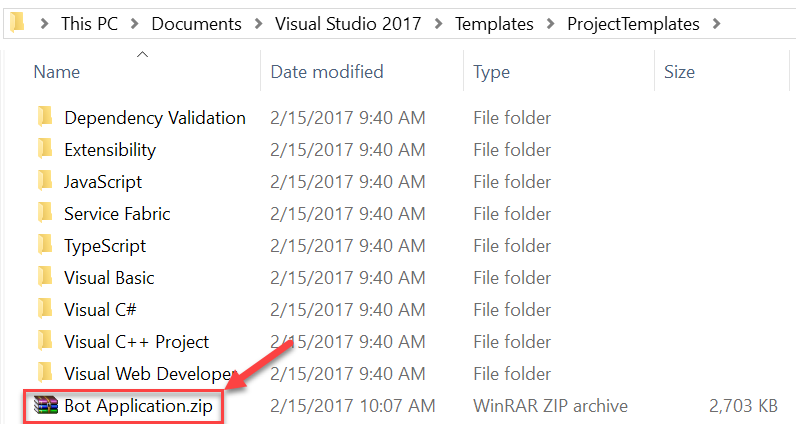

# Prerequisites

Developing Apps for Microsoft Teams requires preparation for both the Office 365 Tenant and the development workstation.

For the Office 365 Tenant, the setup steps are detailed on the [Getting Started page](https://msdn.microsoft.com/en-us/microsoft-teams/setup). Note that while the Getting Started page indicates that the Public Developer Preview is optional, this lab includes steps that are not possible unless the Preview is enabled.

## Install Developer Tools

The developer workstation requires the following tools for this lab.

#### Install NodeJS & NPM

Install [NodeJS](https://nodejs.org/) Long Term Support (LTS) version.

- If you have NodeJS already installed please check you have the latest version using `node -v`. It should return the current [LTS version](https://nodejs.org/en/download/).
- Allowing the Node setup program to update the computer PATH during setup will make the console-based tasks in this easier to accomplish.

After installing node, make sure npm is up to date by running following command:

````shell
npm install -g npm
````

#### Install Yeoman and Gulp

[Yeoman](http://yeoman.io/) helps you kick-start new projects, and prescribes best practices and tools to help you stay productive. This lab uses a Yeoman generator for Microsoft Teams to quickly create a working, JavaScript-based solution.

Enter the following command to install Yeoman and gulp:

````shell
npm install -g yo gulp
````

#### Install Yeoman Teams Generator

The Yeoman Teams generator helps you quickly create a Microsoft Teams solution project with boilerplate code and a project structure & tools to rapidly create and test your app.

Enter the following command to install the Yeoman Teams generator:

````shell
npm install generator-teams@preview -g
````

#### Download ngrok

As Microsoft Teams is an entirely cloud-based product, it requires all services it accesses to be available from the cloud using HTTPS endpoints. Therefore, to enable the exercises to work within Teams, a tunneling application is required.

This lab uses [ngrok](https://ngrok.com) for tunneling publicly-available HTTPS endpoints to a web server running locally on the developer workstation. ngrok is a single-file download that is run from a console.

#### Code Editors

Tabs in Microsoft Teams are HTML pages hosted in an IFrame. The pages can reference CSS and JavaScript like any web page in a browser.

Microsoft Teams supports much of the common [Bot Framework](https://dev.botframework.com/) functionality. The Bot Framework provides an SDK for C# and Node.

You can use any code editor or IDE that supports these technologies, however the steps and code samples in this training use [Visual Studio Code](https://code.visualstudio.com/) for Tabs using HTML/JavaScript and [Visual Studio 2017](https://www.visualstudio.com/) for Bots using the C# SDK.

#### Bot Template for Visual Studio 2017

Download and install the Bot Application template zip from the direct download link [http://aka.ms/bf-bc-vstemplate](http://aka.ms/bf-bc-vstemplate). Save the zip file to your Visual Studio 2017 templates directory which is traditionally located in `%USERPROFILE%\Documents\Visual Studio 2017\Templates\ProjectTemplates\`

   
